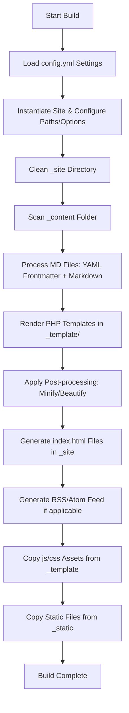

# Indieinabox - Social Personal Website Swiss Knife

Indieinabox is a lightweight, modular static site generator (SSG) built in PHP, tailored for personal and social websites with native support for multi-language content, localized date formatting, HTML minification/beautification, and initial support for IndieWeb principles (like structured content feeds and post classification/kinds).

Currently, the project is undergoing an architectural transition from a procedural model (based on global functions and arrays) to an object-oriented model (with typed classes and namespaces under the `Indieinabox` root).

---

## 🏗️ Project Architecture

The project is structured around a generation pipeline executed via command-line interface (`build.php`). The pipeline consumes content files and transforms them into a final static folder structure in the output directory.

### Build Pipeline Flow



### Directory Structure

```bash
indieinabox2026/
├── _content/          # Input Markdown source files (.md, .txt) organized by routes
├── _data/             # PHP data files returning helper arrays (chars for URLs, translations, etc.)
├── _engine/           # Static generator core
│   ├── classes/       # New OOP namespaced architecture
│   ├── functions/     # Legacy procedural helper functions
│   ├── autoload.php   # SPL autoloader for engine classes
│   └── build.php      # Main file coordinating the build pipeline
├── _template/         # PHP templates defining the page layout (headers, footers, assets)
├── _theme/            # Front-end assets and tools (Webpack, PostCSS)
├── tests/             # Unit test suite using Pest PHP
├── composer.json      # PHP development dependencies (PHPStan, Pest, PHP CodeSniffer)
├── config.yml         # Global site configuration (languages, title, routes)
└── package.json       # Node.js ecosystem configurations
```

---

## ⚙️ Main Features & Components

### 1. Engine Core (`_engine/`)

*   **`build.php`**: The main CLI entry point. It parses CLI arguments using `getopt` (e.g., `-d` for dev mode with live-reload, `-s` to skip static file copy, `-f` to force static file overwrite) and orchestrates config reading, folder scanning, HTML generation, and asset copies.
*   **`autoload.php`**: Registers an `autoloader` function using `spl_autoload_register` to dynamically load `Indieinabox` classes located inside `_engine/classes/`.

### 2. Core Classes (`_engine/classes/`)

*   **`Site`**: The central configuration class that aggregates global settings:
    *   `Site\Metadata`: Site metadata such as title, site name, author, and absolute URL (FQDN).
    *   `Site\Paths`: Directories for base, content (`_content`), and output (`_site`).
    *   `Site\Options`: Logical flags (`buildAll`, `dev`, `skipStatic`, `forceStaticOverride`).
    *   `Site\Localization`: Supported languages (e.g., `[pt-br, en, es]`) and the default language. It uses `__get` and `__set` magic methods to handle access control for private properties.
    *   `Site\Support`: Supported file extensions (e.g., `md`, `html`) and the default category.
*   **`Page`**: Represents a parsed content document, bringing together:
    *   `Page\Metadata`: Document info extracted from YAML frontmatter (tags, title, category, layout).
    *   `Page\Content`: Page body text, image paths, and original content references.
    *   `Page\Localization`: Page localization data (active language, translated paths, translated slug).
*   **`Pages`**: A collection of `Page` objects extending `ArrayObject` to manage the list of pages generated during build time.
*   **`MarkdownParser`**: Handles parsing of Markdown files, delegating responsibilities to specialized helper classes:
    *   `Markdown\FileProcessor`: Validates file types and determines layouts based on folder structure or frontmatter.
    *   `Markdown\ContentProcessor`: Extracts YAML Frontmatter, parses inline hashtags (`#tag`), and converts Markdown body to HTML.
    *   `Markdown\LanguageProcessor`: Determines and applies translation/language configurations for each page.
*   **`Parsedown`**: A modern wrapper around the classical Markdown parser, split into:
    *   `Parsedown\BlocksParser`: Processes structural HTML blocks (tables, lists, paragraphs, code blocks).
    *   `Parsedown\InlinesParser`: Processes inline text tags (links, emphasis, images, email links).
    *   `Parsedown\ElementsHandler`: Controls escaping and safety settings for generated HTML output.
*   **`Yaml`**: A lightweight YAML parser utilized for reading frontmatter and configurations.
*   **`Helper`**: Static utility methods for array access, localized date styling, and page type detection.
*   **`Translations\UrlTranslations`**: Manages bi-directional mapping and slug translation based on the active language (nicks).

### 3. Procedural Functions (`_engine/functions/`)

*   **`general.php`**: Global helper functions for directory scanning (`scan`), sorting posts by date (`sortByDate`), sanitizing strings into slugs (`slugize`), and recursively removing directories (`recursive_rmdir`). Includes a custom helper to convert Unicode characters to ASCII (`utf8ToAscii`).
*   **`createhtml.php`**: Handles the physical writing of generated pages to disk, using the PHP output buffer (`ob_start`) to include templates.
*   **`date.php`**: Formats dates according to the page's language, mapping weekdays and months using localized dictionary arrays from `_data/intl.php`.
*   **`translate.php`**: A dynamic translation dictionary. If a translation is not found in `_data/translations.php`, it automatically appends the source text as empty for translation later and sorts the dictionary alphabetically.
*   **`HtmlMinifier.php` / `beautify-html.php`**: HTML post-processing scripts to optimize bandwidth (minification) or format layout indentation for development mode.
*   **`assets.php` / `static.php`**: Handle migration and copy of static assets, templates, and dev-scripts into the destination build folder (`_site`).

---

## 🛠️ Current Status & Technical Debt (Ongoing Refactoring)

> [!WARNING]
> The project is currently in an incomplete architectural transition phase. There are several type mismatches and bugs in the integration between the legacy procedural codebase and the newly introduced typed classes, which prevent the build from running out of the box.

The main issues found in the codebase are:

1.  **Broken Autoloader Path**:
    *   The `build.php` script attempts to require `_engine/autoloader.php` on line 25, but the actual file in the repository is named `_engine/autoload.php`. This results in an immediate fatal error (`Uncaught Error: Failed opening required ...autoloader.php`) when trying to run the build.
2.  **Case-Sensitive Configurations & Magic Method Switch Mismatch**:
    *   The property assignment loop in `build.php` (line 106) tries to set all-lowercase properties (e.g., `$site->localization->defaultlang`), but the `Localization` class expects camelCase (`defaultLang`) in its magic `__set` switch. This throws an exception (`Property defaultlang does not exist`).
    *   Similar issues occur with other properties like `$site->options->buildall` vs `$site->options->buildAll`.
3.  **Objects Accessed as Arrays Type Mismatch**:
    *   **Templates**: Files inside `_template/` (such as `home.php` and `page.php`) attempt to read `$page["lang"]` by accessing the `$page` variable as an array. However, the generator now passes a typed `Page` object. Since the `Page` class does not implement `ArrayAccess`, this causes a fatal error.
    *   **Helper Functions**: Global functions such as `kind()` (in `kind.php`), `listposts()` (in `listposts.php`), and `translate()` (in `translate.php`) still use array access notation (e.g., `$page["slug"]`) for properties, whereas the updated OOP pipeline passes the `Page` object instance.
    *   **LanguageProcessor**: The namespaced class `Indieinabox\Markdown\LanguageProcessor` accepts `Page $page` in its `processLanguage` method, but starting from line 152 accesses it as an array (e.g., `$page["lang"]`, `$page["slug"]`), throwing a type error.
4.  **Collection Manipulation in `Pages`**:
    *   The `build.php` script instantiates `$pages = new Pages();`. However, during file scanning (`general.php:21`), the engine tries to push elements using `array_push($pages, $page);`. PHP throws a `TypeError` because `array_push` expects a native array, but `$pages` is an object of type `Pages`.
5.  **Array vs Object Mismatch in `FileProcessor`**:
    *   The `FileProcessor` class performs extension validation using `in_array($ext, $this->site->support, true)`. However, `$this->site->support` holds an instance of the `Support` class rather than a native array. The list of allowed extensions actually resides inside `$this->site->support->support`.

---

## 🚀 Running the Project (After fixing the issues above)

### Development and Build

To build the static site:

```bash
# Execute standard build
php _engine/build.php

# Execute development build (with live-reload scripts)
php _engine/build.php -d

# Skip copying static files
php _engine/build.php -s
```

### Testing and Linting

The repository comes with development QA tools:

```bash
# Run unit tests (Pest PHP)
composer test

# Run code linter and sniffer
composer sniffer
```
