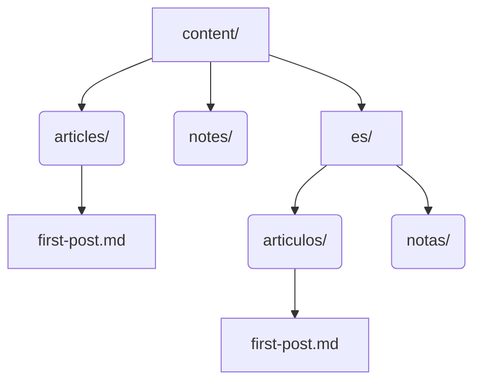

# Customization: Languages & Post Types

IndieInABox is highly modular and allows you to easily expand your site to include multi-language support and
custom post types (kinds) such as `notes`, `photos`, and `garden`.

## Adding New Languages

To add a new language, you don't need to change any hardcoded logic. Follow these steps:

1. **Update `settings` table:** Add the new language code (e.g., `"es"` for Spanish, `"pt-br"` for Portuguese) to
the JSON array in the `lang` setting inside your `database.sql` or SQLite database.
2. **Add Translations:** Insert rows into the `translations` and `url_translations` tables for the new language.
3. **Folder Structure:** Create a folder at the root of your `content/` directory named after the language code.
Place translated markdown files inside with identical paths to their default-language counterparts.



*Note: If a file exists in the default language but is missing in the localized folder, IndieInABox will
automatically virtualize it, falling back to the default content.*

---

## Adding Custom Post Types (Kinds)

"Kinds" refer to different types of posts (e.g., articles, microblog notes, photo galleries, or digital gardens).

### 1. Database Configuration

You must register the new kind in the `kinds` table. For example, to add a `note` type:

```sql
INSERT INTO kinds (kind_key, config_json) VALUES ('note', 
'{"content_dir":"notes","title":{"en":"Notes"},"palette":{"bg":"#FFF","fg":"#000"},"has_title":false,"show_on_home":false}'
);
```
* **`content_dir`**: The folder name inside `content/` where these posts live.
* **`has_title`**: Set to `false` for microblog-style notes that don't need dedicated titles.
* **`show_on_home`**: Whether these posts should appear in the main index feed.

### 2. Path Mapping

Add the mapping to the `kindspath` setting in the `settings` table:
```json
{"article":["articles"], "note":["notes"], "photo":["photos"], "garden":["garden"]}
```

### Examples of Custom Kinds

Here is how you might utilize custom kinds for different IndieWeb concepts:

#### Notes (Microblogging)
Notes are short, title-less posts similar to tweets. They often show up directly in a timeline feed.


#### Photos
Photo posts emphasize visual content over text. They might have a masonry layout on the index page and large,
immersive views on individual pages.


#### Digital Garden
A digital garden is a collection of interconnected notes that grow over time. These posts often use wikilinks
(`[[like this]]`) and might feature a visual graph mapping the connections between pages.


